# Termux / ZeroTermux  

## Install Graphical Interface  

Use the official graphical display software **Termux-x11** and install the **Xfce4** desktop environment.  

⚠️ Before starting, download the following apps:  
- [Termux](https://github.com/termux/termux-app/releases) / [ZeroTermux](https://od.ixcmstudio.cn/repository/main/ZeroTermux/)  
- [Termux-x11](https://github.com/termux/termux-x11/releases)  

1. Open **Termux/ZeroTermux** and update the package sources:  
```bash
   pkg update && pkg upgrade
```

2. Install the required packages:

   ```bash
   pkg install x11-repo xfce4 termux-x11-nightly -y
   ```
3. Run **termux-x11**:

   ```bash
   termux-x11 &
   ```
4. In a new Termux session, set the **DISPLAY** variable and start Xfce:

   ```bash
   export DISPLAY=:0
   startxfce4 &
   ```
5. Open the **termux-x11** app, and the desktop will be displayed.

---

## Install Firefox Browser

```bash
pkg install firefox
```

Open the Xfce4 desktop GUI environment, click the browser icon at the bottom of the desktop, and you can use Firefox.

---

## Install Java IDE (IntelliJ IDEA)

```bash
wget https://raw.githubusercontent.com/zryyoung/Termux/main/install_idea.sh && bash install_idea.sh
```

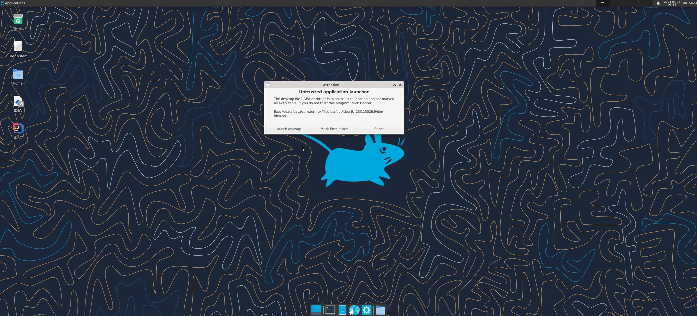
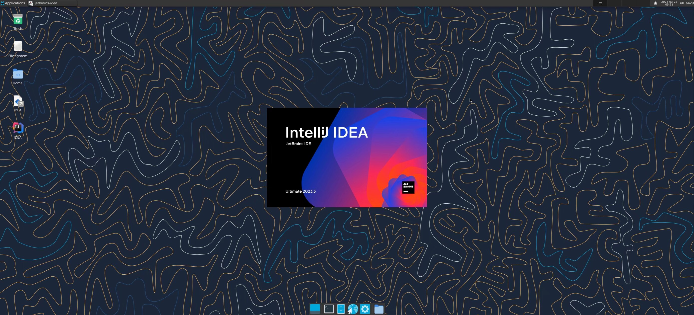
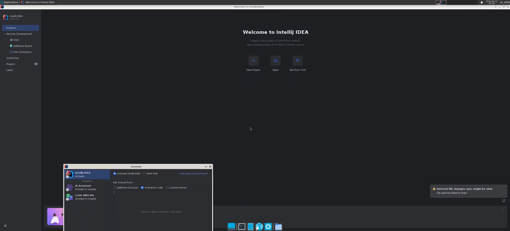
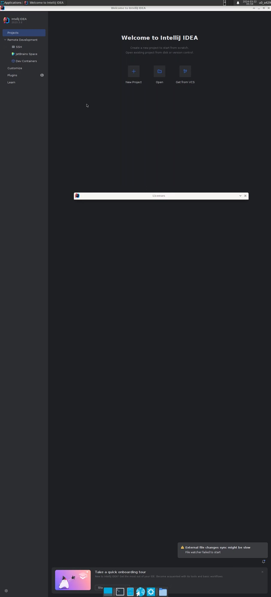
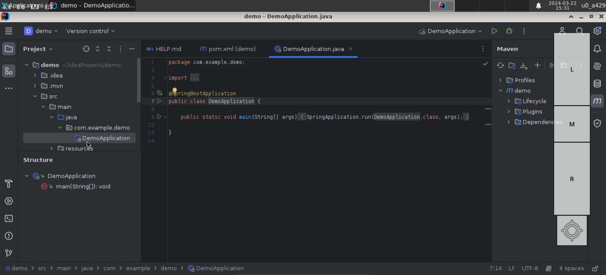
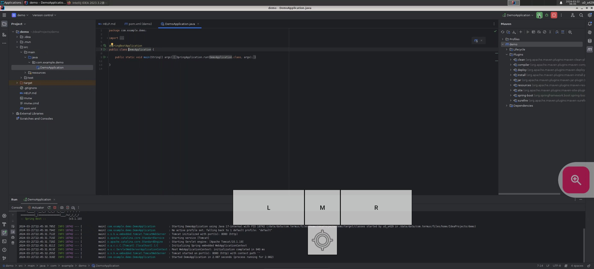

---

## Install Python IDE (PyCharm)

```bash
wget https://raw.githubusercontent.com/zryyoung/Termux/main/install_idea.sh && bash install_pycharm.sh
```

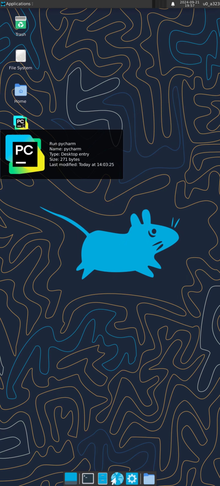
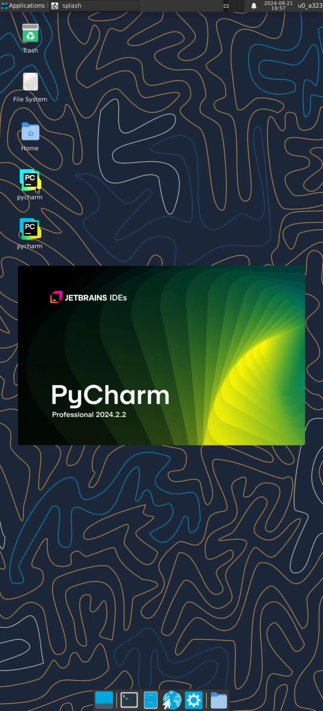
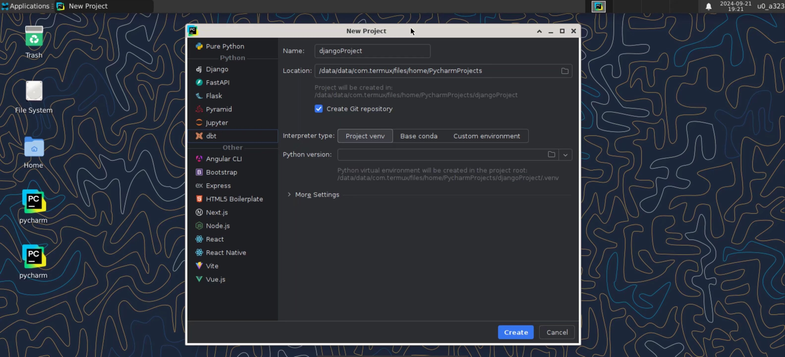
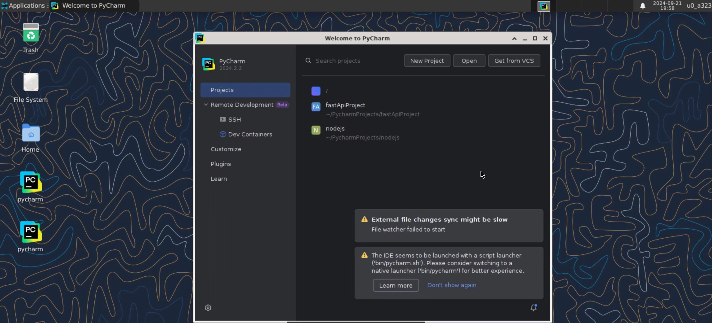
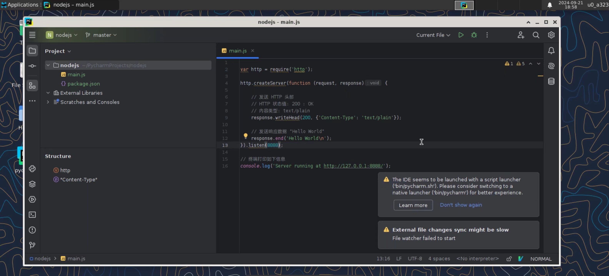
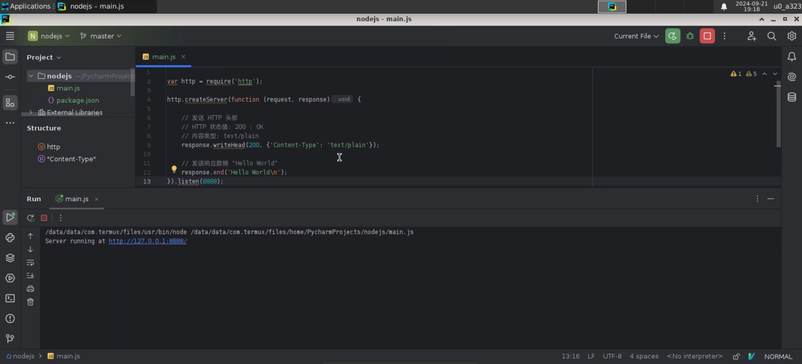
